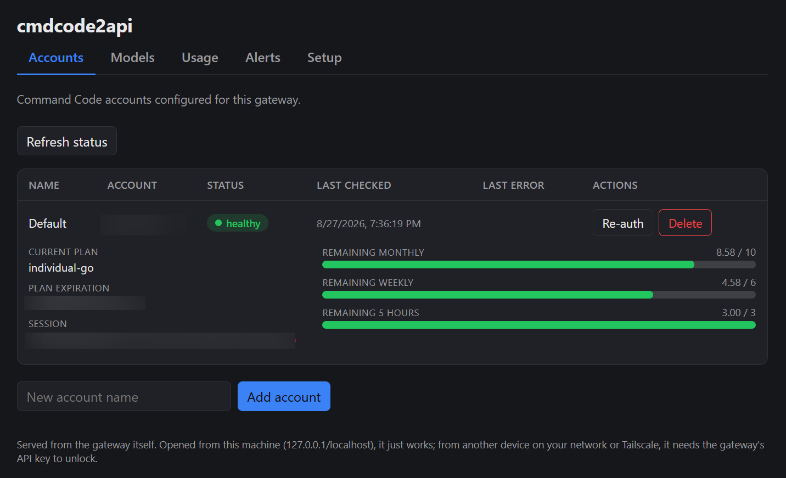
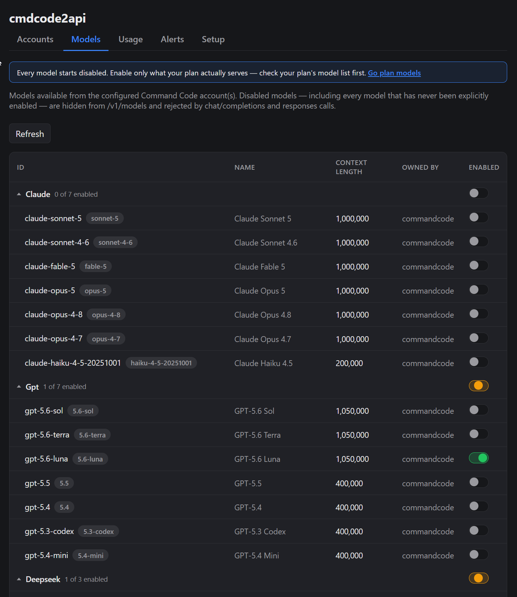
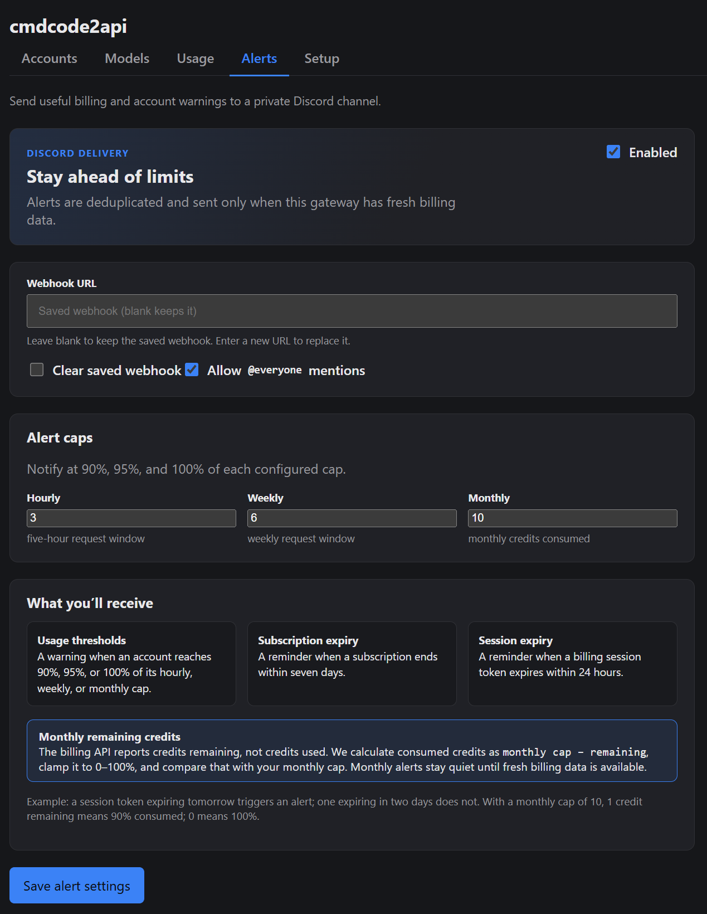
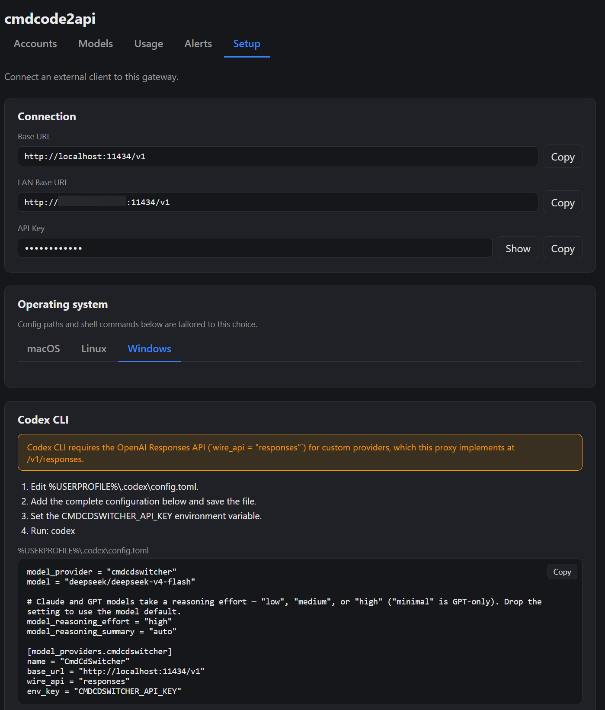

# cmdcode2api

`cmdcode2api` is a small OpenAI-compatible gateway for [Command Code](https://commandcode.ai/). It lets OpenAI-style clients call Command Code models through familiar endpoints such as `/v1/chat/completions` and `/v1/models`.

The project was originally named `cc-gateway`; it was renamed to avoid confusion with Claude Code's common `cc` abbreviation.

## Features

- OpenAI-compatible HTTP API
  - `POST /v1/chat/completions`
  - `POST /v1/responses` (OpenAI Responses API, for Codex CLI compatibility)
  - `GET /v1/models`
- Streaming and non-streaming chat completions
- OpenAI base64 data `image_url` conversion to Command Code / Anthropic-style image blocks
- Browser OAuth helper for obtaining Command Code API keys for one or more named accounts
- Multi-account rotation: requests round-robin across configured accounts, with automatic failover and staleness detection
- Local bearer-token auth for clients
- CORS enabled for local UI clients
- Usage counter persisted to `usage.json`
- Per-account billing/credit polling from Command Code (five-hour, weekly, and monthly windows), shown in the web UI and `GET /admin/billing`
- Optional Discord alerts for usage thresholds and expiring subscriptions or billing sessions
- Health endpoint: `GET /health`
- Usage endpoint: `GET /usage` — unauthenticated, global totals only, unchanged
- Admin usage endpoint: `GET /admin/usage` — loopback-gated, adds a per-account breakdown
- Admin billing endpoint: `GET /admin/billing` — loopback-gated, per-account credit windows
- Accounts endpoint: `GET /accounts`

## Build

```bash
go build -o cmdcode2api ./cmd/cmdcode2api
```

## Project layout

```text
cmd/cmdcode2api/   CLI entrypoint
internal/app/      gateway implementation
```

## Web UI

The account-management UI served at `/ui` is a TypeScript + React app built
with Vite, living in `internal/app/webui-src/`. Its build output is committed
to `internal/app/webui/dist/` and embedded into the Go binary, so `go build`
never needs Node installed.

| Accounts | Models |
| --- | --- |
|  |  |

| Alerts | Setup |
| --- | --- |
|  |  |

After editing the UI, rebuild and commit the output:

```bash
cd internal/app/webui-src
npm install
npm run build
```

## First run

Run the binary once to generate `config.yaml`:

```bash
./cmdcode2api
```

Then connect a Command Code account, giving it a name:

```bash
./cmdcode2api --oauth --account personal
```

`--account <name>` is required whenever you use `--oauth`. The OAuth flow
writes the Command Code API key into `config.yaml` under that account name.
Run the same command again with a different `--account` name to add more
accounts. See [Accounts](#accounts) below for how the gateway uses them.

### Authorizing on a remote or headless server

The OAuth flow waits for a callback on `http://localhost:5959/callback`, and
Command Code only allows a `localhost` callback. When the gateway runs on a
server without a browser, forward port 5959 over SSH from the machine that
has one (Windows included) so that `localhost` callback still reaches the
server.

1. From your workstation, open an SSH session that forwards the callback
   port, and leave it open for the whole flow:

   ```bash
   ssh -L 5959:localhost:5959 user@server
   ```

2. In that session, on the server, start the flow for one account. It binds
   `127.0.0.1:5959` and prints an authorization URL:

   ```bash
   ./cmdcode2api --oauth --account personal
   ```

   (The web UI's "Add account" / "Reauthorize" buttons do the same thing and
   also work through the tunnel.)

3. Open the printed URL in the browser on your workstation and approve. The
   callback travels back through the tunnel; the key is written into
   `config.yaml`.

4. Close the SSH session (`exit`) and restart the gateway to load the new
   account.

Port 5959 is fixed — don't pass `--oauth-callback` for the tunnel
case; the default `localhost` callback is what makes it work. Use
`--oauth-callback` only when something other than `localhost:5959` must
receive the callback (for example a public HTTPS reverse proxy).

## Accounts

Command Code accounts are stored by name in `config.yaml`. Add as many as
you like:

```bash
./cmdcode2api --oauth --account personal
./cmdcode2api --oauth --account work
```

Running `--oauth --account <name>` again for a name that already exists
overwrites that account's key. That's also how you reauthorize an account
that has gone stale.

List configured accounts and their live status without starting the server:

```bash
./cmdcode2api --list-accounts
```

Remove an account:

```bash
./cmdcode2api --remove-account work
```

### Rotation and failover

While the server is running, `/v1/chat/completions` requests round-robin
across every account that isn't marked stale. If Command Code returns `401`
or `403` for an account, the gateway marks it stale and routes subsequent
requests to the remaining accounts. A background probe also rechecks every
account roughly every 10 minutes (a lightweight authenticated call against
Command Code), so a dead key gets caught even without live traffic. A `200`
response clears a stale flag; transient failures such as timeouts or 5xx
responses are recorded but leave the account's status untouched.

Command Code API keys have no refresh mechanism, so a stale account needs a
fresh login, not a restart:

```bash
./cmdcode2api --oauth --account <name>
```

Check current status anytime with `--list-accounts` or `GET /accounts`.

## Configuration

`config.yaml` is created automatically and intentionally ignored by git.

Example shape:

```yaml
api_key: ccgw-generated-local-client-key
accounts:
  - name: personal
    api_key: your-command-code-api-key
    base_url: https://api.commandcode.ai
host: localhost
port: 11434
allow_lan: false
allow_tailscale: false
model_overrides:
  deepseek/deepseek-v4-pro: true
```

Fields:

- `api_key` — local bearer token required by clients calling this gateway.
- `accounts` — list of Command Code accounts, each with a `name`, an `api_key` obtained via `--oauth --account <name>`, and a `base_url`. An optional `session_token` enables billing/credit polling and the credit-window Discord alerts for that account — see [Billing session token](#billing-session-token).
- `host` — HTTP listen host. Defaults to `localhost`. Use `0.0.0.0` to listen on all interfaces.
- `port` — local listen port. Defaults to `11434`.
- `allow_lan` — when `true`, other devices on your local network can reach this gateway. Detects your LAN IP automatically at startup and prints it in the log. Defaults to `false`. If `host` is still the default `localhost`, enabling this switches it to `0.0.0.0` for you.
- `allow_tailscale` — same, but for a device reachable over [Tailscale](https://tailscale.com/), if it's installed and connected on this machine. Detects the Tailscale IP automatically at startup. Defaults to `false`.
- `ui_no_auth` — when `true`, serves `/ui` and the account-management API (`/accounts*`, `/admin/*`) with no authentication; the LLM proxy at `/v1/*` still requires `api_key`. Trusted networks only: it exposes add/remove account, OAuth, model policy and billing to anyone who can reach the port. Defaults to `false`. Also settable per-run with `--ui-no-auth`.
- `model_overrides` — per-model enabled/disabled overrides, keyed by exact model ID. This is the only way to enable a model — see below.
- `discord_webhook_url` — optional Discord webhook URL for five-hour/weekly usage threshold and subscription-ending alerts. The URL is never logged.
- `discord_alert_state_file` — optional durable deduplication state path; defaults to `discord-alerts.json`.
- `discord_alerts` — optional Discord alert settings. `webhook_url` and `state_file` are equivalent to the legacy top-level fields. The UI never returns the webhook URL: its write-only password field keeps the existing URL when blank, replaces it when a new URL is entered, and offers an explicit clear action. `hourly_cap`, `weekly_cap`, and `monthly_cap` default to 3, 6, and 10. The hourly cap applies to the upstream five-hour window. The monthly API value `monthlyCredits` is a remaining balance, so monthly consumed credits are calculated as `monthly_cap - monthlyCredits`, clamped to the configured cap. Thus remaining values of 1, 0.5, and 0 correspond to 90%, 95%, and 100% consumed when the default monthly cap is 10.
- Session-token expiration alerts are sent only when a billing session expires within 24 hours. Subscription expiration alerts remain within seven days.
- Set `mention_everyone: true` under `discord_alerts` to prefix every alert with the plain-text Discord `@everyone` mention. It defaults to `false`.
- `family_overrides` — per-family enabled/disabled overrides, keyed by family (e.g. `deepseek/deepseek-v4`). Set from the web UI's Models tab, which expands the family into exact `model_overrides` entries; applies to new models added to that family later.
- `exclude_models` — legacy prefix-blocklist field from before every model was disabled by default. Still decoded from old config files so they load without error, but no longer consulted for anything.

`allow_lan`/`allow_tailscale` only make the port reachable — they do not
weaken authentication. The web UI's tokenless convenience login only
applies to a genuine same-machine (loopback) request; from a LAN or
Tailscale device (or anywhere else) you still need the `api_key`, which the
web UI will prompt you for the first time you open it from that device.

`--ui-no-auth` (or `ui_no_auth: true` in `config.yaml`) removes that
requirement for the admin surface only, so the web UI loads from a remote
browser without pasting in the key. It does not touch the `/v1/*` proxy
routes, which still require `api_key`. Use it only on a trusted network:
anyone who can reach the port can then add or remove accounts, run the
OAuth flow, change model policy and read billing. The startup log prints a
`WARNING: ui_no_auth is set` line while it is active.

If you have a `config.yaml` from before multi-account support, its single
`commandcode: {api_key, base_url}` block is migrated automatically into an
`accounts` list with one account named `default` the next time it loads.

### Enabling models

Every model starts disabled — a fresh `config.yaml` has no `model_overrides`
at all, and `GET /v1/models` returns an empty list until you enable
something. Enable the models your plan actually serves from the web UI's
Models tab at `http://localhost:11434/ui#models`, which persists your
choices to `model_overrides` in `config.yaml`. See
[commandcode.ai/docs/plans/go#models](https://commandcode.ai/docs/plans/go#models)
for what's included on the Go plan.

### Billing session token

Credit polling (the web UI credit bars, `GET /admin/billing`, and the
usage-threshold Discord alerts) needs a `session_token` for the account —
the `__Secure-commandcode_prod_.session_token` browser cookie from a
logged-in commandcode.ai session. The gateway's `api_key` won't work here;
Command Code's billing API authenticates with this cookie instead.

To get it:

1. Log in to <https://commandcode.ai> in a browser.
2. Open DevTools (F12) → **Application** (Chrome) or **Storage** (Firefox)
   → **Cookies** → `https://commandcode.ai`.
3. Copy the **Value** of the `__Secure-commandcode_prod_.session_token`
   cookie.
4. Paste it into the **Session token** field for that account on the
   Accounts tab and save, or set `session_token:` under the account in
   `config.yaml`.

The token expires — Command Code issues short-lived sessions, which is why
the 24-hour session-expiry alert exists. When it lapses, repeat the steps
with a fresh value. Treat it like a password: it grants read access to
your billing data. The gateway keeps it only in `config.yaml`, which git
ignores, and never logs or returns it.

### Discord alerts

Set a `webhook_url` under `discord_alerts` (or the legacy top-level
`discord_webhook_url`) to get a Discord message when usage crosses a
configured threshold or a subscription is about to lapse. The web UI's
Alerts tab writes these, and its webhook field is write-only — blank keeps
the current URL, a new value replaces it, and there's an explicit clear.

Threshold alerts need per-account credit data, which comes from a
[billing session token](#billing-session-token). Without one, a config
that has a webhook still sends subscription- and session-expiry warnings.

Caps default to `hourly_cap: 3`, `weekly_cap: 6`, `monthly_cap: 10`; the
hourly cap tracks Command Code's rolling five-hour window. Subscription
expiry alerts fire within seven days, session-token expiry within 24
hours. Set `mention_everyone: true` to prefix each alert with `@everyone`.
Dedup state is written to `discord-alerts.json` (override with
`state_file`), which git ignores.

## Run

```bash
./cmdcode2api
```

To listen on all interfaces, useful for systemd or a remote server:

```bash
./cmdcode2api --host 0.0.0.0
```

To open the gateway up to your local network and/or Tailscale, use
`--allow-lan`/`--allow-tailscale` (or the matching `config.yaml` fields)
instead — these also switch `host` to `0.0.0.0` for you if it's still the
default:

```bash
./cmdcode2api --allow-lan --allow-tailscale
```

The server logs every URL it's actually reachable at, e.g.:

```text
cmdcode2api starting, listening on 0.0.0.0:11434
reachable at http://localhost:11434 (loopback, no API key needed for /ui)
reachable at http://192.168.1.50:11434 (LAN — /ui requires the API key)
reachable at http://100.101.102.103:11434 (Tailscale — /ui requires the API key)
```

If `allow_tailscale` is set but Tailscale isn't installed or connected, the
log says so instead of printing a URL.

## Use with OpenAI-compatible clients

Set the base URL to your local gateway:

```text
http://localhost:11434/v1
```

Use the generated `api_key` from `config.yaml` as the bearer token.

### curl example

```bash
curl http://localhost:11434/v1/chat/completions \
  -H "Authorization: Bearer <local-api-key>" \
  -H "Content-Type: application/json" \
  -d '{
    "model": "deepseek/deepseek-v4-pro",
    "messages": [
      {"role": "user", "content": "Hello!"}
    ],
    "stream": false
  }'
```

### Streaming

```bash
curl http://localhost:11434/v1/chat/completions \
  -H "Authorization: Bearer <local-api-key>" \
  -H "Content-Type: application/json" \
  -d '{
    "model": "deepseek/deepseek-v4-pro",
    "messages": [
      {"role": "user", "content": "Write a short haiku."}
    ],
    "stream": true
  }'
```

## Endpoints

### `GET /health`

No authentication required.

```json
{"status":"ok"}
```

### `GET /usage`

No authentication required. Returns locally accumulated usage counters:

```json
{
  "total_requests": 1,
  "prompt_tokens": 7527,
  "completion_tokens": 55,
  "cache_read_tokens": 7424,
  "cache_write_tokens": 0
}
```

Usage is persisted to `usage.json`, which is ignored by git. This is the
global-totals view only; it never breaks usage down by account.

### `GET /admin/usage`

Like `/admin/models` and `/admin/connection`, a genuine same-machine
(loopback) browser request gets in without a bearer token — the
loopback+Host+Origin gate used for the account-management UI (same-machine
TCP peer, a `Host` header of `localhost`/`127.0.0.1`/`[::1]`, and — if
present — an `Origin` that matches it). Any other caller, including a LAN
or Tailscale device once `allow_lan`/`allow_tailscale` is on, needs the
correct `api_key` as a bearer token like any other endpoint. It returns the
same global totals as `GET /usage` plus a per-account breakdown:

```json
{
  "total_requests": 12,
  "prompt_tokens": 41200,
  "completion_tokens": 980,
  "cache_read_tokens": 39000,
  "cache_write_tokens": 0,
  "accounts": [
    {
      "account": "personal",
      "total_requests": 7,
      "prompt_tokens": 25000,
      "completion_tokens": 600,
      "cache_read_tokens": 24000,
      "cache_write_tokens": 0
    },
    {
      "account": "work",
      "total_requests": 5,
      "prompt_tokens": 16200,
      "completion_tokens": 380,
      "cache_read_tokens": 15000,
      "cache_write_tokens": 0
    }
  ]
}
```

```bash
curl http://localhost:11434/admin/usage
```

(from the machine hosting the gateway, no `Authorization` header needed;
from anywhere else, add `-H "Authorization: Bearer <api_key>"`.)

### `GET /admin/billing`

Same loopback+Host+Origin gate as `/admin/usage`. Returns one row per
account that has a `session_token`, each with the current five-hour,
weekly, and monthly credit windows polled from Command Code plus the
subscription and session expiry the Discord alerts watch. Accounts without
a session token are omitted. This is the data behind the web UI's credit
bar.

### `GET /accounts`

Requires the same bearer token as `/v1/chat/completions`, unlike `/health` and `/usage`. Returns each configured account's name and live status, never the API key:

```json
[
  {"name": "personal", "status": "healthy", "last_checked": "2026-08-24T10:00:00Z"},
  {"name": "work", "status": "stale", "last_checked": "2026-08-24T09:50:00Z", "last_error": "http 401"}
]
```

`status` is `unknown` (not probed yet), `healthy`, or `stale`. Reauthorize a stale account with `--oauth --account <name>`.

### `GET /v1/models`

Returns only the models enabled via `model_overrides` (see
[Enabling models](#enabling-models)) — an empty list until you've enabled at
least one.

### `POST /v1/chat/completions`

Accepts OpenAI-style chat completion requests and forwards them to Command Code.
Requests for a disabled model return `404` with the existing OpenAI-compatible error JSON shape.

Supported request styles:

- Plain text messages
- Multimodal content arrays with base64 `data:` URLs in `image_url`
- `stream: true` server-sent events
- `stream: false` JSON response

Remote HTTP(S) image URLs are rejected with `400 invalid_request_error`; image
content must be supplied as a base64 `data:image/...;base64,...` URL.

### `POST /v1/responses`

Implements OpenAI's Responses API protocol, for compatibility with clients
that speak it instead of Chat Completions (notably Codex CLI). Requires the
same bearer token as `/v1/chat/completions`, and is adapted onto the same
Command Code dispatch pipeline, so it shares that endpoint's enabled-model
gate, account rotation, and failover behavior.

The gateway is stateless: `previous_response_id` is not supported, since
there's no server-side conversation store to resolve it against. Send the
full conversation in `input` on every request.

```bash
curl http://localhost:11434/v1/responses \
  -H "Authorization: Bearer <local-api-key>" \
  -H "Content-Type: application/json" \
  -d '{
    "model": "deepseek/deepseek-v4-pro",
    "input": "Hello!",
    "stream": false
  }'
```

## Files intentionally not committed

The repository ignores runtime/secrets artifacts:

```text
cmdcode2api
cc-gateway
config.yaml
usage.json
discord-alerts.json
*.exe
.oauth_state
.oauth_url
```

Debug dumps (`log.txt*`, `*.log`, `*.patch`) are ignored too — `--debug`
writes full request bodies and SSE events, so they can contain prompts and
source. Local agent/tooling state (`.claude/`, `.serena/`, `.sisyphus/`)
is also excluded.

## Notes

This is a personal utility gateway and currently targets the Command Code API shape observed during development. If Command Code changes its internal API, the adapter may need updates.
